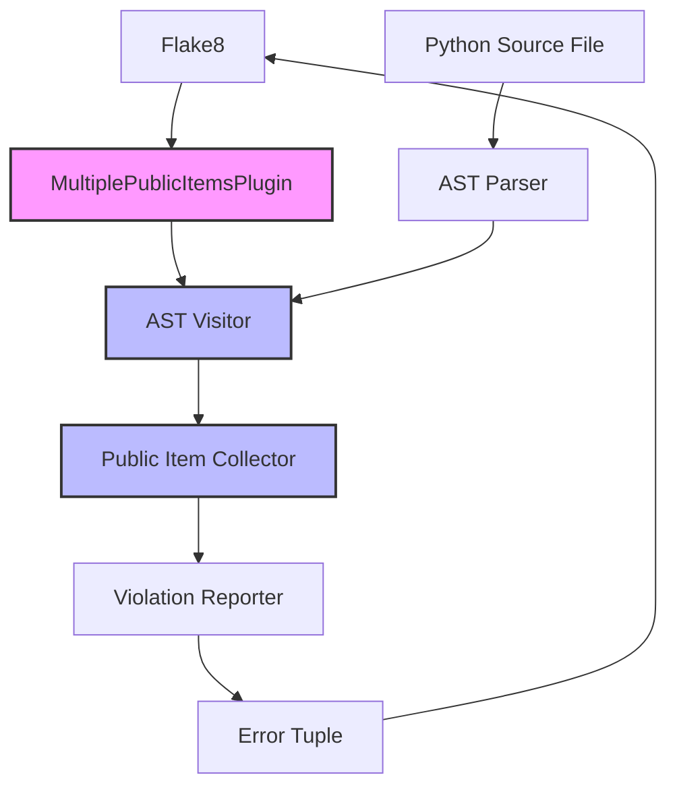
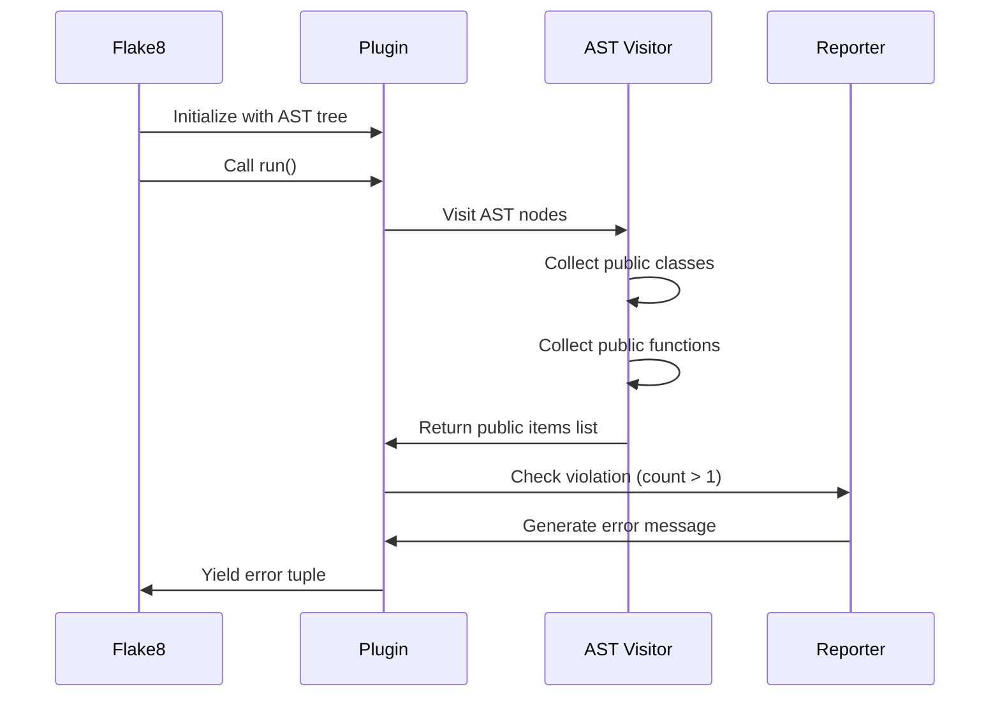

# Feature Implementation Plan: Multiple Public Items Per File Linter

_Generated: 2025-06-22_
_Based on Feature Specification: /Users/zach/code/pyla-linter/.tasks/20250622/20250622-multiple-public-items-per-file-feature.md_

## Architecture Overview

This implementation adds a new flake8 linter plugin that enforces the one-public-item-per-file rule. The plugin will follow the established pattern from the existing length_checker linter, using AST traversal to identify public classes and functions at the module level and reporting violations as a single error per file.

### System Architecture

### Data Flow

## Technology Stack

### Core Technologies

- **Language/Runtime:** Python 3.12+
- **Framework:** Flake8 plugin framework
- **Testing:** pytest with pytest-mock

### Libraries & Dependencies

- **Backend/API:** Python AST module (standard library)
- **Testing:** pytest, pytest-mock
- **Utilities:** flake8

### Patterns & Approaches

- **Architectural Patterns:** Visitor Pattern for AST traversal
- **Design Patterns:** Plugin architecture pattern
- **Development Practices:** Test-driven development, following existing linter patterns

### External Integrations

- **Tools:** Flake8 (as plugin host)

## Relevant Files

- `src/linters/multiple_public_items/` - New directory for the linter implementation
- `src/linters/multiple_public_items/__init__.py` - Package initialization and exports
- `src/linters/multiple_public_items/plugin.py` - Main plugin class implementing flake8 interface
- `src/linters/multiple_public_items/ast_visitor.py` - AST visitor for collecting public items
- `src/tests/linters/multiple_public_items/` - Test directory
- `src/tests/linters/multiple_public_items/__init__.py` - Test package initialization
- `src/tests/linters/multiple_public_items/test_multiple_public_items.py` - Unit tests
- `pyproject.toml` - Update with new plugin entry point

## Implementation Notes

- Tests should typically be placed in a dedicated test directory following the project's conventions.
- Use the appropriate test runner for your technology stack (e.g., `poetry run pytest` for Python, `npm test` for Node.js, etc.).
- Follow the project's existing file naming and directory structure conventions.
- After completing each subtask, mark the subtask as complete and update the files modified list and include a brief description of the changes made to each file
- Run formatting, linting, building and testing tools after each task
- After completing a parent task, stop and do not continue with the next task until the user confirms to proceed.

## Implementation Tasks

- [ ] 1.0 Create plugin infrastructure and AST visitor

  - [ ] 1.1 Create the multiple_public_items directory structure under src/linters/
  - [ ] 1.2 Implement AST visitor class to collect public classes and functions at module level
  - [ ] 1.3 Write unit tests for AST visitor with various file structures

  ### Files modified with description of changes

  - (to be filled in after task completion)

- [ ] 2.0 Implement main plugin class

  - [ ] 2.1 Create plugin class implementing flake8 interface with run() method
  - [ ] 2.2 Implement violation detection logic (count > 1 public items)
  - [ ] 2.3 Generate error messages listing all public items with proper formatting
  - [ ] 2.4 Write unit tests for plugin class and error message generation

  ### Files modified with description of changes

  - (to be filled in after task completion)

- [ ] 3.0 Integrate plugin with flake8

  - [ ] 3.1 Update pyproject.toml to register the new plugin entry point
  - [ ] 3.2 Create __init__.py files to properly export plugin class
  - [ ] 3.3 Write integration tests to verify flake8 discovers and runs the plugin

  ### Files modified with description of changes

  - (to be filled in after task completion)

- [ ] 4.0 Comprehensive testing and edge cases

  - [ ] 4.1 Write tests for edge cases (empty files, only private functions, nested classes)
  - [ ] 4.2 Test flake8 configuration integration (exclude, per-file-ignores)
  - [ ] 4.3 Performance testing with large files
  - [ ] 4.4 Verify error code MPF001 is properly assigned

  ### Files modified with description of changes

  - (to be filled in after task completion)