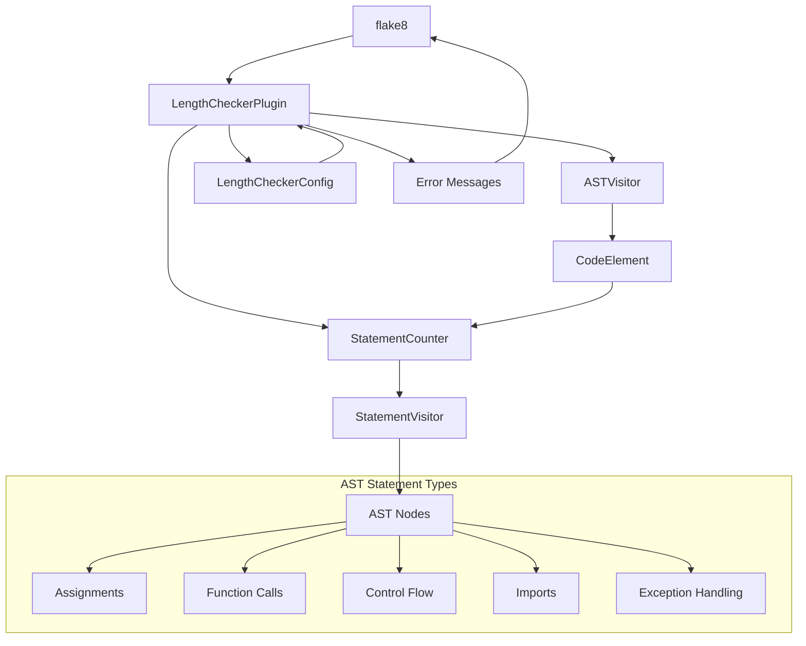
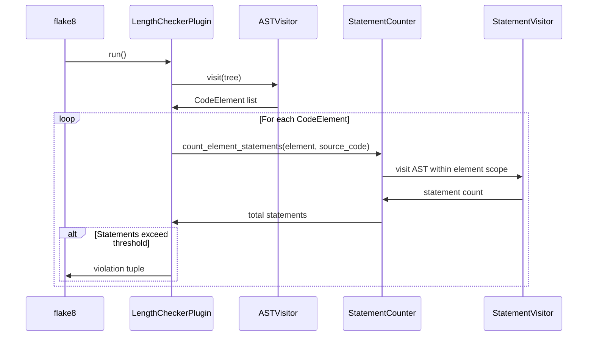

# Feature Implementation Plan: Update Length Checker to Count Logical Statements

_Generated: 2025-06-22_
_Based on Feature Specification: [20250622-update-length-checker-logical-statements-feature.md](./20250622-update-length-checker-logical-statements-feature.md)_

## Architecture Overview

This feature transforms the existing line-based counting mechanism to an AST-based logical statement counting system. The core architecture remains the same, but the `LineCounter` class will be replaced with a `StatementCounter` class that uses AST traversal to identify and count executable statements within functions and classes.

### System Architecture

### Data Flow

## Technology Stack

### Core Technologies

- **Language/Runtime:** Python 3.12
- **Package Manager:** Poetry
- **Linting Framework:** flake8 7.0.0
- **AST Parsing:** Python built-in `ast` module

### Libraries & Dependencies

- **Configuration:** `tomli` 2.0.0 for TOML parsing
- **Logging:** `pyla-logger` 1.0.0 
- **Testing:** `pytest` 8.4.0, `pytest-mock` 3.14.1
- **Code Quality:** `black` 23.1.0, `isort` 5.12.0, `pyright` 1.1.402

### Patterns & Approaches

- **Architectural Patterns:** Plugin-based architecture following flake8 conventions
- **Design Patterns:** Visitor pattern for AST traversal, Strategy pattern for counting logic
- **Development Practices:** Test-driven development, type annotations

### External Integrations

- **flake8:** Plugin registration via `tool.poetry.plugins."flake8.extension"`
- **Configuration:** `pyproject.toml` integration via `[tool.pyla-linters]`

## Relevant Files

- `src/linters/length_checker/line_counter.py` - Core counting logic to be replaced with statement counting
- `src/linters/length_checker/plugin.py` - Main plugin class that integrates with flake8
- `src/linters/length_checker/ast_visitor.py` - AST visitor for finding classes and functions
- `src/linters/length_checker/code_element.py` - Data structure representing code elements
- `src/linters/length_checker/config.py` - Configuration handling
- `src/linters/length_checker/docstring_finder.py` - Docstring detection (may need updates)
- `src/tests/linters/length_checker/test_length_checker.py` - Comprehensive test suite
- `pyproject.toml` - Configuration and plugin registration

## Implementation Notes

- Tests should be updated simultaneously with implementation changes to maintain coverage
- Use `poetry run pytest` for running tests and `poetry run poe autolint` for quality checks
- Follow existing naming conventions and module structure
- Maintain backward compatibility for all configuration options
- After completing each subtask, run quality checks: `poetry run poe autolint` and `poetry run pytest`
- After completing a parent task, stop and wait for confirmation before proceeding

## Implementation Tasks

- [x] 1.0 Create AST Statement Counter Core Logic

  - [x] 1.1 Create new `StatementVisitor` class for AST traversal within code elements
  - [x] 1.2 Implement statement type detection for all required AST node types (Assign, Expr, Return, etc.)
  - [x] 1.3 Add scope boundary handling to prevent counting nested function/class statements
  - [x] 1.4 Handle compound statements correctly (if/elif/else, try/except/finally as separate units)
  - [x] 1.5 Create comprehensive unit tests for the StatementVisitor class
  - [x] 1.6 Implement performance optimizations for AST traversal

  ### Files modified with description of changes

  - `src/linters/length_checker/statement_visitor.py` - Created new StatementVisitor class that counts logical statements within code elements using AST traversal. Handles all Python statement types while properly excluding nested function/class content. Includes context-aware counting for class methods vs nested definitions.
  - `src/tests/linters/length_checker/test_statement_visitor.py` - Created comprehensive test suite with 27 test cases covering all statement types, edge cases, nested structures, performance scenarios, and boundary conditions. All tests pass and verify correct statement counting behavior.

- [ ] 2.0 Replace LineCounter with StatementCounter

  - [ ] 2.1 Rename `line_counter.py` to `statement_counter.py` and update class name
  - [ ] 2.2 Replace `count_element_lines()` method with `count_element_statements()` method
  - [ ] 2.3 Update method signature and implementation to use StatementVisitor
  - [ ] 2.4 Maintain exclusion logic for comments, docstrings, and empty lines
  - [ ] 2.5 Update all import statements throughout the codebase
  - [ ] 2.6 Update comprehensive unit tests for StatementCounter functionality

  ### Files modified with description of changes

  - (to be filled in after task completion)

- [ ] 3.0 Update Plugin Integration and Error Messages

  - [ ] 3.1 Update `plugin.py` to import and use StatementCounter instead of LineCounter
  - [ ] 3.2 Modify violation message methods to reference "statements" instead of "lines"
  - [ ] 3.3 Update error message formatting to maintain flake8 compatibility
  - [ ] 3.4 Ensure all error codes (EL001, EL002, WL001, WL002) remain unchanged
  - [ ] 3.5 Update method calls from `count_element_lines` to `count_element_statements`
  - [ ] 3.6 Test plugin integration with flake8 CLI and configuration loading

  ### Files modified with description of changes

  - (to be filled in after task completion)

- [ ] 4.0 Update CodeElement Integration

  - [ ] 4.1 Update `code_element.py` method references for statement counting
  - [ ] 4.2 Update `get_effective_lines()` method name to `get_effective_statements()`
  - [ ] 4.3 Update docstrings and comments to reflect statement counting
  - [ ] 4.4 Ensure proper type annotations for new statement counting methods
  - [ ] 4.5 Update unit tests for CodeElement changes

  ### Files modified with description of changes

  - (to be filled in after task completion)

- [ ] 5.0 Comprehensive Test Suite Updates

  - [ ] 5.1 Update all existing test cases to validate statement counts instead of line counts
  - [ ] 5.2 Add new test cases for compound statement handling (if/elif/else, try/except/finally)
  - [ ] 5.3 Add test cases for nested function and class scope isolation
  - [ ] 5.4 Add edge case tests for malformed AST nodes and syntax errors
  - [ ] 5.5 Add performance tests to ensure statement counting meets performance requirements
  - [ ] 5.6 Update test helper functions and assertion methods
  - [ ] 5.7 Verify 100% test coverage is maintained

  ### Files modified with description of changes

  - (to be filled in after task completion)

- [ ] 6.0 Final Integration and Validation

  - [ ] 6.1 Run complete test suite and ensure all tests pass
  - [ ] 6.2 Verify flake8 plugin registration works correctly
  - [ ] 6.3 Test configuration loading from pyproject.toml and command line overrides
  - [ ] 6.4 Perform integration testing with sample Python files
  - [ ] 6.5 Validate error message formatting and error codes
  - [ ] 6.6 Run performance benchmarks to ensure acceptable performance
  - [ ] 6.7 Update any remaining documentation or docstrings

  ### Files modified with description of changes

  - (to be filled in after task completion)